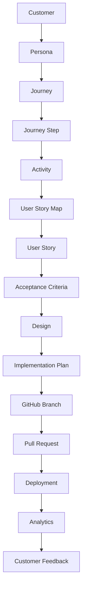

# Product Management OS (PMOS)

<p align="center">
  <strong>The AI-Native Product Operating System</strong>
</p>

<p align="center">
  <a href="https://github.com/your-username/pmos/issues">Issues</a> •
  <a href="https://github.com/your-username/pmos/projects">Projects</a> •
  <a href="https://github.com/your-username/pmos/wiki">Wiki</a> •
  <a href="https://github.com/your-username/pmos/discussions">Discussions</a>
</p>

<p align="center">
  
  
  
  
</p>

---

## ⚡ The 9-Step Pipeline

> "PMOS: run the full import pipeline on https://github.com/user/repo"

| Step | What Happens | Output |
|------|-------------|--------|
| **1. GitHub Import** | Clone, read README, package.json, routes, components, API, database, prompts, agents, tests, env vars | `repo-index.json` |
| **2. Repository Intelligence** | Analyze architecture, domain model, tech stack, existing features, missing docs | Architecture diagram, domain model, feature inventory |
| **3. Run Application** | Detect `npm run dev` or `docker compose up`, launch app | Running application at localhost |
| **4. Journey Discovery** | Playwright crawls the app like a real customer — screenshot every screen | Screenshots, screen inventory, UX notes |
| **5. Story Mapping** | Each screen → Activities → Tasks → Stories | Jeff Patton story map |
| **6. Build Backlog** | AI identifies: missing features, tech debt, bugs, UX issues, performance, security | Full story backlog |
| **7. Agent Kanban** | 7 agents get assigned stories based on their role | Agent work queues |
| **8. Product Dashboard** | Live metrics: health score, journey steps, screens, stories, improvements, agents | Dashboard |
| **9. Continuous Learning** | Every commit updates journey, story map, architecture, docs, tasks | Auto-sync |

**After completion**: The PM never manually updates Jira again.

---

## 🤖 The 7 Agent Teams

| Agent | Owns |
|-------|------|
| **Product Manager** | Roadmap, stories, priorities, customer journey |
| **UX Designer** | Journey, wireframes, screens, flows, accessibility |
| **Architect** | Architecture, patterns, tech debt, APIs |
| **Software Engineer** | Implementation, testing, PRs, commits |
| **QA Engineer** | Testing, regression, performance, accessibility |
| **Documentation** | README, architecture, release notes, API docs |
| **Product Intelligence** | Continuous monitoring, anomaly detection |

### The Product Intelligence Agent

The secret weapon. It continuously watches the repo and asks:

- "The upload flow changed. Should the customer journey be updated?"
- "A new route was added, but no user story references it."
- "This API has no visible UI. Is it orphaned or planned?"
- "Three new components were introduced without design approval."
- "The story map still shows an old onboarding flow."
- "This feature shipped, but there are no analytics events associated with it."

---

## 🐕 The Dogfood Principle

**VOXStyle Video Creator** is the first project and the reference implementation.

Every feature added to PMOS must first answer:

> "Does this make managing VOXStyle Video Creator easier?"

If not, it probably isn't MVP. Real-world validation instead of designing in the abstract.

---

## 🎯 Vision

PMOS is an open-source **Product Management Operating System** that acts as the orchestration layer between Product Managers, UX Designers, AI Coding Agents, GitHub, and deployment environments.

This is **not** another project management tool like Jira or Linear. Instead, PMOS becomes the operating system that manages the complete product lifecycle from customer discovery to production while keeping every artifact connected.

### How It Works

```
You → Tell AI Agent → Agent reads ~/.pmos → Agent acts on projects
```

No servers. No databases. No login. Just files that any AI can understand.

---

## 🧭 Core Philosophy

Traditional tools begin with tickets. **PMOS begins with the customer.**

Every artifact must be connected through the Product Knowledge Graph:

```
Customer
    ↓
Persona
    ↓
Journey
    ↓
Journey Step
    ↓
Activity
    ↓
User Story Map
    ↓
User Story
    ↓
Acceptance Criteria
    ↓
Design
    ↓
Implementation Plan
    ↓
GitHub Branch
    ↓
Pull Request
    ↓
Deployment
    ↓
Analytics
    ↓
Customer Feedback
```

> **Every feature in production should be traceable back to the original customer problem.**
> **Likewise every customer problem should be traceable to the implementation that solved it.**

---

## 🚀 Primary Goal

Build an AI-native Product Management platform where Product Managers can:

| Capability | Description |
|------------|-------------|
| 🔍 **Discover** | Customer problems through research, interviews, and data analysis |
| 🗺️ **Generate** | Customer journeys and user story maps |
| 📊 **Prioritize** | Work using RICE, WSJF, Kano, and other frameworks |
| 📋 **Plan** | Generate implementation plans with full traceability |
| 🎨 **Review** | Designs with integrated AI design review |
| 🤖 **Assign** | Work to AI coding agents with context |
| 👁️ **Monitor** | Coding progress in real-time |
| 🎬 **Demo** | Review functional demos instead of code |
| ✅ **Approve** | Releases with full audit trail |
| 📈 **Analyze** | Product success with connected analytics |

---

## 📖 Guiding Principles

1. **Customer Journey is the source of truth**
2. **Story Maps are generated from the journey**
3. **Stories generate implementation plans**
4. **AI Coding Agents execute the plans**
5. **PMs review behavior rather than code**
6. **Everything is traceable**
7. **Documentation is executable**
8. **No duplicate information**
9. **Everything exists only once inside the Product Graph**

---

## 🔧 Three Product Creation Modes

### 1. Existing Website Mode

**Input:** Website URL (e.g., `https://example.com`)

**System automatically:**
- Crawls every page
- Discovers navigation structure
- Identifies CTAs and forms
- Captures screenshots
- Discovers customer flows
- Builds customer journey
- Generates personas
- Infers Jobs-To-Be-Done
- Generates story map
- Detects UX problems
- Suggests improvements

**Output:**
```
├── Customer Journey
├── Story Map
├── Screenshots
├── Backlog
├── Pain Points
└── Improvement Opportunities
```

---

### 2. Existing GitHub Repository Mode

**Input:** GitHub Repository URL

**System automatically:**
- Analyzes routes, components, navigation
- Analyzes authentication, API, database
- Runs the application locally
- Automatically navigates the application
- Captures screenshots

**Generates:**
```
├── Customer Journey
├── Current Story Map
├── Screens
├── Current Features
├── Missing Features
├── Technical Debt
├── Unused Routes
├── Dead Features
├── Architecture Diagram
├── Domain Model
└── Dependency Graph
```

---

### 3. Greenfield Product Mode

**Input:**
- Product idea
- Problem statement
- Target audience
- Goals

**System automatically generates:**
```
├── Personas
├── Jobs-To-Be-Done
├── Customer Journey
├── Wireframes
├── Story Map
├── Initial Backlog
├── Roadmap
├── Architecture
├── Database Schema
├── API Design
├── UI Components
└── Coding Plan
```

---

## 📦 Core Modules

### [Discovery](./docs/modules/discovery.md)
Collect and analyze data from customer interviews, support tickets, Slack, GitHub Issues, and more. AI clusters insights into pain points, themes, and opportunities.

### [Customer Journey Engine](./docs/modules/customer-journey.md)
Visual customer journey editor with screenshots, goals, CTAs, pain points, and connected stories.

### [Story Mapping](./docs/modules/story-mapping.md)
Jeff Patton style story mapping with AI-generated acceptance criteria, dependencies, and edge cases.

### [Prioritization](./docs/modules/prioritization.md)
Support for RICE, WSJF, Kano, MoSCoW, and more. AI recommends, PM decides.

### [Product Specification Engine](./docs/modules/specification.md)
Structured feature specifications replacing static PRDs with connected data.

### [AI Design Review](./docs/modules/design-review.md)
Integrated workflow from wireframe to high-fidelity design with PM and designer approval.

### [Coding Agent Manager](./docs/modules/coding-agents.md)
Generate implementation plans, assign to specialized AI agents, track progress.

### [Kanban](./docs/modules/kanban.md)
AI-first Kanban board with specialized columns for the complete lifecycle.

### [Demo Engine](./docs/modules/demo-engine.md)
Automated demos with screenshots, walkthroughs, and performance reports.

### [Review Layer](./docs/modules/review-layer.md)
Comment directly on running applications. AI converts comments to actionable items.

### [Product Analytics](./docs/modules/analytics.md)
Connect Amplitude, Mixpanel, PostHog, Google Analytics with story-level tracking.

### [Product Flight Recorder](./docs/modules/flight-recorder.md)
Complete audit trail from customer insight to deployment.

---

## 🧠 Product Graph

Every object exists inside a graph database:



**Entities:**
- Persona, Journey, Journey Step
- Screen, Story, Feature
- Design, Component, API
- Database Table, GitHub Issue
- Branch, PR, Deployment
- Analytics Event, Decision

---

## 🤖 AI Agents

PMOS uses specialized AI agents instead of a single coding agent:

| Agent | Responsibilities |
|-------|------------------|
| 🎯 **Chief Product Officer** | Strategic direction, prioritization |
| 📋 **Product Manager** | Feature ownership, stakeholder alignment |
| 📊 **Product Analyst** | Data analysis, metrics, insights |
| 🔬 **UX Researcher** | User interviews, usability testing |
| 🎨 **UX Designer** | Wireframes, prototypes, design systems |
| 🏗️ **System Architect** | Technical architecture, decisions |
| 💻 **Frontend Engineer** | UI implementation, components |
| ⚙️ **Backend Engineer** | APIs, services, database |
| 🧪 **QA Engineer** | Testing, quality assurance |
| 🚀 **DevOps Engineer** | CI/CD, infrastructure |
| 📝 **Documentation Writer** | Docs, specs, guides |
| 📦 **Release Manager** | Deployments, releases |
| 📈 **Analytics Engineer** | Data pipelines, tracking |

Each agent has:
- **Context** - Understanding of the product and codebase
- **Responsibilities** - Defined scope of work
- **Memory** - Persistent knowledge across sessions
- **Playbooks** - Step-by-step workflows
- **Decision Frameworks** - How to make trade-offs
- **Skills** - Specific capabilities

---

## 🔗 GitHub Integration

GitHub becomes the execution engine:

```
Story → Implementation Plan → Create Branch → Assign AI Agent → 
Commit → Pull Request → Preview Deployment → PM Review → Merge → Release
```

Everything synchronizes automatically.

---

## 🎨 AIonUX Integration

AIonUX becomes the design subsystem:

- Generate wireframes
- Create mockups
- Build design systems
- Create component libraries
- Prototype flows
- PM comments synchronize back into PMOS

---

## 📁 Repository Structure

```
pmos/
├── README.md                          # This file
├── LICENSE                            # MIT License
├── CONTRIBUTING.md                    # Contribution guidelines
├── ROADMAP.md                         # Project roadmap
│
├── docs/
│   ├── vision.md                      # Detailed vision
│   ├── architecture/
│   │   ├── overview.md                # Architecture overview
│   │   ├── system-design.md           # System design
│   │   ├── data-model.md              # Data model
│   │   └── decision-records/          # ADRs
│   │
│   ├── modules/
│   │   ├── discovery.md
│   │   ├── customer-journey.md
│   │   ├── story-mapping.md
│   │   ├── prioritization.md
│   │   ├── specification.md
│   │   ├── design-review.md
│   │   ├── coding-agents.md
│   │   ├── kanban.md
│   │   ├── demo-engine.md
│   │   ├── review-layer.md
│   │   ├── analytics.md
│   │   └── flight-recorder.md
│   │
│   ├── agents/
│   │   ├── README.md                  # Agent overview
│   │   ├── chief-product-officer.md
│   │   ├── product-manager.md
│   │   ├── ux-researcher.md
│   │   ├── ux-designer.md
│   │   ├── system-architect.md
│   │   ├── frontend-engineer.md
│   │   ├── backend-engineer.md
│   │   ├── qa-engineer.md
│   │   ├── devops-engineer.md
│   │   └── ...
│   │
│   ├── guides/
│   │   ├── getting-started.md
│   │   ├── developer-guide.md
│   │   ├── coding-standards.md
│   │   └── prompt-engineering.md
│   │
│   └── api/
│       ├── openapi.yaml
│       └── examples/
│
├── skills/
│   ├── README.md                      # Skills overview
│   ├── discovery/
│   ├── journey/
│   ├── story-map/
│   ├── specification/
│   ├── design/
│   ├── coding/
│   └── deployment/
│
├── templates/
│   ├── feature-spec.md
│   ├── user-story.md
│   ├── acceptance-criteria.md
│   ├── implementation-plan.md
│   └── release-notes.md
│
├── prompts/
│   ├── README.md                      # Prompt library
│   ├── discovery/
│   ├── journey/
│   ├── story-mapping/
│   ├── specification/
│   ├── design/
│   └── coding/
│
├── epics/
│   ├── 01-discovery/
│   ├── 02-customer-journey/
│   ├── 03-story-mapping/
│   ├── 04-prioritization/
│   ├── 05-specification/
│   ├── 06-design-review/
│   ├── 07-coding-agents/
│   ├── 08-kanban/
│   ├── 09-demo-engine/
│   ├── 10-analytics/
│   └── 11-integrations/
│
├── database/
│   ├── schema/
│   ├── migrations/
│   └── seeds/
│
├── api/
│   ├── src/
│   └── tests/
│
├── web/
│   ├── src/
│   └── tests/
│
└── .github/
    ├── ISSUE_TEMPLATE/
    ├── PULL_REQUEST_TEMPLATE.md
    └── workflows/
        ├── ci.yml
        └── release.yml
```

---

## 🎬 Demo Workflow

When a story reaches **Demo Ready**:

1. **Launch** - Application starts in preview environment
2. **Navigate** - System navigates to affected screen
3. **Highlight** - Changes are visually highlighted
4. **Narrate** - Feature is explained with context
5. **Screenshot** - Capture for documentation
6. **Comment** - PM adds inline comments
7. **Follow-up** - AI creates new stories from feedback

---

## 📊 Versioned Journey

Customer journeys support version history:

```
Journey v1 (Current) → Journey v2 (Planned) → Journey v3 (Future)
```

Compare differences between journey versions over time.

---

## 🛠️ Getting Started

See [Getting Started Guide](./docs/guides/getting-started.md) for detailed setup instructions.

### Quick Start

```bash
# Clone the repository
git clone https://github.com/your-username/pmos.git

# Navigate to project
cd pmos

# Install dependencies
npm install

# Set up environment
cp .env.example .env

# Start development
npm run dev
```

---

## 🤝 Contributing

We welcome contributions! Please read our [Contributing Guide](./CONTRIBUTING.md) first.

- 🐛 [Report Bugs](https://github.com/your-username/pmos/issues/new?template=bug_report.md)
- 💡 [Request Features](https://github.com/your-username/pmos/issues/new?template=feature_request.md)
- 📖 [Improve Docs](https://github.com/your-username/pmos/edit/main/README.md)
- 🔧 [Submit PRs](https://github.com/your-username/pmos/pulls)

---

## 📜 License

This project is licensed under the MIT License - see the [LICENSE](./LICENSE) file for details.

---

## 🙏 Acknowledgments

This project draws architectural inspiration from:

- **Corey Haines' Marketing Skills** - AI skill architecture and shared context
- **Product Manager Skills Repository** - PM skill definitions
- **PM Brain** - Product management knowledge
- **AI Native PM OS** - AI-native product management concepts

PMOS expands these ideas into a complete AI-native product lifecycle operating system focused on Product Management first.

---

## 🌟 Long-Term Vision

**PMOS should become the Cursor or Claude Code equivalent for Product Management.**

Instead of helping engineers write code, it should help Product Managers orchestrate the entire lifecycle of product development—from customer discovery through design, AI implementation, deployment, analytics, and continuous learning.

The end goal is to establish PMOS as the **open-source standard for AI-native Product Management**.

---

<p align="center">
  Built with ❤️ by the PMOS Community
</p>
