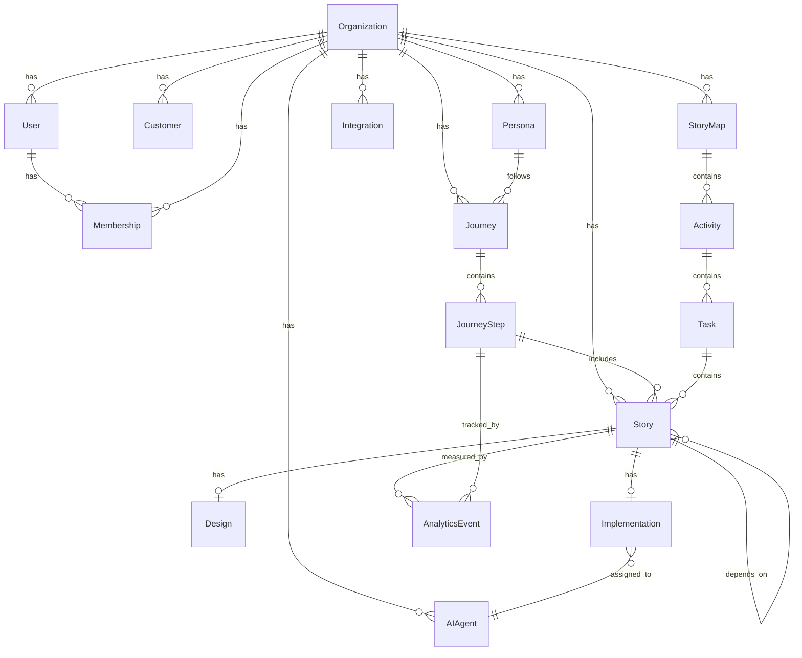

# Data Model

## 🎯 Overview

This document defines the complete data model for PMOS, including entity relationships, graph structure, and data flow patterns.

---

## 📊 Entity Relationship Diagram



---

## 📋 Core Entities

### Organization

The top-level tenant entity.

```typescript
interface Organization {
  id: string;                    // UUID
  name: string;                  // Display name
  slug: string;                  // URL-friendly identifier
  settings: OrganizationSettings;
  createdAt: Date;
  updatedAt: Date;
}

interface OrganizationSettings {
  defaultLlmProvider: string;
  defaultLlmModel: string;
  enabledFeatures: string[];
  integrations: Record<string, any>;
}
```

### User

Individual users within the system.

```typescript
interface User {
  id: string;                    // UUID
  email: string;                 // Unique email
  name: string;                  // Display name
  avatarUrl?: string;            // Profile image
  createdAt: Date;
  updatedAt: Date;
}

interface Membership {
  id: string;
  userId: string;
  organizationId: string;
  role: MembershipRole;
  createdAt: Date;
}

type MembershipRole = 'owner' | 'admin' | 'member' | 'viewer';
```

---

## 👥 Customer & Personas

### Customer

Represents an actual customer or user segment.

```typescript
interface Customer {
  id: string;
  organizationId: string;
  name?: string;                 // Optional identifier
  email?: string;                // Optional contact
  segments: string[];            // Customer segments
  attributes: Record<string, any>;  // Flexible attributes
  createdAt: Date;
  updatedAt: Date;
}
```

### Persona

Archetypal user representation.

```typescript
interface Persona {
  id: string;
  organizationId: string;
  name: string;                  // e.g., "Busy Professional"
  description: string;
  goals: string[];               // What they want to achieve
  frustrations: string[];        // Pain points
  demographics: PersonaDemographics;
  jobsToBeDone: JobToBeDone[];
  createdAt: Date;
  updatedAt: Date;
}

interface PersonaDemographics {
  age?: string;
  occupation?: string;
  technicalSkill?: 'beginner' | 'intermediate' | 'advanced';
  [key: string]: any;
}

interface JobToBeDone {
  id: string;
  statement: string;             // "When [situation], I want to [motivation], so I can [outcome]"
  context: string;
  motivation: string;
  expectedOutcome: string;
}
```

---

## 🗺️ Journeys

### Journey

The customer journey through the product.

```typescript
interface Journey {
  id: string;
  organizationId: string;
  personaId: string;
  name: string;
  description?: string;
  version: number;               // Version number
  status: JourneyStatus;
  metadata: JourneyMetadata;
  createdAt: Date;
  updatedAt: Date;
}

type JourneyStatus = 'draft' | 'active' | 'archived';

interface JourneyMetadata {
  tags: string[];
  owner?: string;
  lastReviewed?: Date;
  reviewNotes?: string;
}
```

### Journey Step

Individual step in the journey.

```typescript
interface JourneyStep {
  id: string;
  journeyId: string;
  order: number;                 // Position in journey
  name: string;
  description?: string;
  screenshotUrl?: string;        // Screenshot of the step
  goal: string;                  // What the user is trying to do
  painPoints: string[];          // Issues at this step
  primaryCta?: string;           // Main call-to-action
  relatedScreens: string[];      // Screens involved
  futureImprovements: string[];
  metadata: Record<string, any>;
  createdAt: Date;
  updatedAt: Date;
}
```

---

## 📝 Story Mapping

### Story Map

The overall story map structure.

```typescript
interface StoryMap {
  id: string;
  organizationId: string;
  journeyId: string;
  name: string;
  createdAt: Date;
  updatedAt: Date;
}
```

### Activity

High-level user activity.

```typescript
interface Activity {
  id: string;
  storyMapId: string;
  name: string;
  description?: string;
  order: number;
  createdAt: Date;
  updatedAt: Date;
}
```

### Task

Specific task within an activity.

```typescript
interface Task {
  id: string;
  activityId: string;
  name: string;
  description?: string;
  order: number;
  createdAt: Date;
  updatedAt: Date;
}
```

---

## 📖 Stories

### Story

The core unit of work.

```typescript
interface Story {
  id: string;
  organizationId: string;
  taskId?: string;               // From story map
  journeyStepId?: string;        // From journey
  title: string;
  description?: string;
  
  // Requirements
  acceptanceCriteria: string[];
  businessRules: string[];
  edgeCases: string[];
  
  // Prioritization
  priority: Priority;
  storyPoints?: number;
  valueScore?: number;
  effortScore?: number;
  
  // Status
  status: StoryStatus;
  assigneeId?: string;           // User or AI agent
  
  // Metadata
  tags: string[];
  metadata: Record<string, any>;
  
  createdAt: Date;
  updatedAt: Date;
}

type Priority = 'critical' | 'high' | 'medium' | 'low';

type StoryStatus = 
  | 'backlog'
  | 'refinement'
  | 'ready'
  | 'in-progress'
  | 'review'
  | 'testing'
  | 'done'
  | 'cancelled';

interface StoryMetrics {
  usageCount?: number;
  conversionRate?: number;
  retentionImpact?: number;
  revenueImpact?: number;
  customerSatisfaction?: number;
}
```

### Story Dependency

Relationships between stories.

```typescript
interface StoryDependency {
  storyId: string;
  dependsOnId: string;
  type: DependencyType;
}

type DependencyType = 
  | 'blocks'           // Cannot start until dependency is done
  | 'blocked-by'       // Opposite of blocks
  | 'related-to'       // Loose relationship
  | 'same-epic';       // Grouping
```

---

## 🎨 Designs

### Design

Design artifact for a story.

```typescript
interface Design {
  id: string;
  storyId: string;
  type: DesignType;
  status: DesignStatus;
  assets: DesignAsset[];
  metadata: DesignMetadata;
  createdAt: Date;
  updatedAt: Date;
}

type DesignType = 'wireframe' | 'mockup' | 'prototype' | 'design-system';

type DesignStatus = 'draft' | 'in-review' | 'revision' | 'approved';

interface DesignAsset {
  id: string;
  url: string;
  type: string;                  // 'image', 'figma', 'sketch', etc.
  name: string;
  metadata: Record<string, any>;
}

interface DesignMetadata {
  tool?: string;                 // 'figma', 'sketch', 'ai-generated'
  version?: string;
  dimensions?: { width: number; height: number };
}
```

### Design Comment

Feedback on designs.

```typescript
interface DesignComment {
  id: string;
  designId: string;
  userId: string;
  content: string;
  position?: DesignPosition;     // Where on the design
  resolved: boolean;
  replies: DesignComment[];
  createdAt: Date;
  updatedAt: Date;
}

interface DesignPosition {
  x: number;
  y: number;
  width?: number;
  height?: number;
}
```

---

## 💻 Implementations

### Implementation

Track the coding implementation of a story.

```typescript
interface Implementation {
  id: string;
  storyId: string;
  agentId: string;               // AI agent doing the work
  plan: ImplementationPlan;
  branchName?: string;
  pullRequestUrl?: string;
  status: ImplementationStatus;
  metrics: ImplementationMetrics;
  createdAt: Date;
  updatedAt: Date;
}

type ImplementationStatus = 
  | 'planned'
  | 'in-progress'
  | 'review'
  | 'testing'
  | 'merged'
  | 'deployed'
  | 'failed';

interface ImplementationPlan {
  tasks: PlanTask[];
  files: FileChange[];
  tests: TestPlan[];
  decisions: ArchitectureDecision[];
  estimatedTime?: number;        // In minutes
}

interface PlanTask {
  id: string;
  description: string;
  status: 'pending' | 'in-progress' | 'done';
  files?: string[];
}

interface FileChange {
  path: string;
  action: 'create' | 'update' | 'delete';
  description: string;
}

interface TestPlan {
  type: 'unit' | 'integration' | 'e2e';
  description: string;
  file?: string;
}

interface ArchitectureDecision {
  id: string;
  title: string;
  context: string;
  decision: string;
  consequences: string[];
}

interface ImplementationMetrics {
  linesAdded?: number;
  linesRemoved?: number;
  filesChanged?: number;
  testsAdded?: number;
  executionTime?: number;
}
```

---

## 🤖 AI Agents

### AI Agent

Represents an AI agent with a specific role.

```typescript
interface AIAgent {
  id: string;
  organizationId: string;
  name: string;
  role: AgentRole;
  description: string;
  context: AgentContext;
  memory: AgentMemory;
  skills: string[];
  status: AgentStatus;
  config: AgentConfig;
  createdAt: Date;
  updatedAt: Date;
}

type AgentRole = 
  | 'chief-product-officer'
  | 'product-manager'
  | 'product-analyst'
  | 'ux-researcher'
  | 'ux-designer'
  | 'system-architect'
  | 'frontend-engineer'
  | 'backend-engineer'
  | 'qa-engineer'
  | 'devops-engineer'
  | 'documentation-writer'
  | 'release-manager'
  | 'analytics-engineer';

type AgentStatus = 'idle' | 'busy' | 'offline' | 'error';

interface AgentContext {
  productContext: string;
  codeContext?: string;
  designContext?: string;
  recentInteractions: Interaction[];
}

interface AgentMemory {
  shortTerm: MemoryEntry[];      // Current conversation
  longTerm: MemoryEntry[];       // Persisted knowledge
  episodic: Episode[];           // Past experiences
}

interface MemoryEntry {
  id: string;
  content: string;
  embedding?: number[];
  timestamp: Date;
  importance: number;
}

interface Episode {
  id: string;
  task: string;
  outcome: string;
  learnings: string[];
  timestamp: Date;
}

interface AgentConfig {
  llmProvider: string;
  llmModel: string;
  temperature: number;
  maxTokens: number;
  tools: string[];
}
```

---

## 📈 Analytics

### Analytics Event

Track user interactions and metrics.

```typescript
interface AnalyticsEvent {
  id: string;
  organizationId: string;
  storyId?: string;
  eventType: string;
  properties: Record<string, any>;
  timestamp: Date;
  userId?: string;
  sessionId?: string;
}

interface AnalyticsMetrics {
  storyId: string;
  period: 'day' | 'week' | 'month';
  startDate: Date;
  endDate: Date;
  metrics: {
    usage: number;
    uniqueUsers: number;
    conversionRate?: number;
    retentionRate?: number;
    revenue?: number;
    errors?: number;
    performance?: PerformanceMetrics;
  };
}

interface PerformanceMetrics {
  loadTime: number;
  interactionTime: number;
  errorRate: number;
}
```

---

## 🔗 Integrations

### Integration

External service connections.

```typescript
interface Integration {
  id: string;
  organizationId: string;
  type: IntegrationType;
  name: string;
  config: IntegrationConfig;
  status: IntegrationStatus;
  lastSync?: Date;
  metadata: Record<string, any>;
  createdAt: Date;
  updatedAt: Date;
}

type IntegrationType = 
  | 'github'
  | 'figma'
  | 'slack'
  | 'jira'
  | 'linear'
  | 'amplitude'
  | 'mixpanel'
  | 'posthog'
  | 'google-analytics'
  | 'vercel'
  | 'netlify';

type IntegrationStatus = 'active' | 'inactive' | 'error';

interface IntegrationConfig {
  apiKey?: string;
  webhookUrl?: string;
  syncFrequency?: number;        // In minutes
  [key: string]: any;
}
```

---

## 🗃️ Graph Database Schema

### Node Types

```cypher
// Customer
CREATE (c:Customer {
  id: $id,
  name: $name,
  organizationId: $orgId
})

// Persona
CREATE (p:Persona {
  id: $id,
  name: $name,
  description: $description,
  organizationId: $orgId
})

// Journey
CREATE (j:Journey {
  id: $id,
  name: $name,
  version: $version,
  status: $status,
  organizationId: $orgId
})

// JourneyStep
CREATE (js:JourneyStep {
  id: $id,
  name: $name,
  order: $order,
  goal: $goal
})

// Story
CREATE (s:Story {
  id: $id,
  title: $title,
  status: $status,
  priority: $priority,
  organizationId: $orgId
})

// Design
CREATE (d:Design {
  id: $id,
  type: $type,
  status: $status
})

// Implementation
CREATE (impl:Implementation {
  id: $id,
  status: $status,
  branchName: $branch
})

// AIAgent
CREATE (agent:AIAgent {
  id: $id,
  name: $name,
  role: $role,
  status: $status
})

// Feature
CREATE (f:Feature {
  id: $id,
  name: $name,
  description: $description
})

// Component
CREATE (comp:Component {
  id: $id,
  name: $name,
  type: $type
})

// API
CREATE (api:API {
  id: $id,
  method: $method,
  path: $path
})

// DatabaseTable
CREATE (db:DatabaseTable {
  id: $id,
  name: $name,
  schema: $schema
})

// GitHubIssue
CREATE (issue:GitHubIssue {
  id: $id,
  number: $number,
  title: $title,
  state: $state
})

// PullRequest
CREATE (pr:PullRequest {
  id: $id,
  number: $number,
  title: $title,
  state: $state
})

// Deployment
CREATE (dep:Deployment {
  id: $id,
  environment: $environment,
  status: $status,
  version: $version
})

// Decision
CREATE (dec:Decision {
  id: $id,
  title: $title,
  context: $context,
  decision: $decision,
  timestamp: $timestamp
})
```

### Relationship Types

```cypher
// Customer relationships
MATCH (c:Customer), (p:Persona)
CREATE (c)-[:HAS_PERSONA]->(p)

MATCH (p:Persona), (j:Journey)
CREATE (p)-[:FOLLOWS]->(j)

// Journey relationships
MATCH (j:Journey), (js:JourneyStep)
CREATE (j)-[:CONTAINS {order: $order}]->(js)

MATCH (js:JourneyStep), (s:Story)
CREATE (js)-[:INCLUDES]->(s)

// Story map relationships
MATCH (sm:StoryMap), (a:Activity)
CREATE (sm)-[:HAS_ACTIVITY {order: $order}]->(a)

MATCH (a:Activity), (t:Task)
CREATE (a)-[:HAS_TASK {order: $order}]->(t)

MATCH (t:Task), (s:Story)
CREATE (t)-[:CONTAINS]->(s)

// Design relationships
MATCH (s:Story), (d:Design)
CREATE (s)-[:HAS_DESIGN]->(d)

// Implementation relationships
MATCH (s:Story), (impl:Implementation)
CREATE (s)-[:HAS_IMPLEMENTATION]->(impl)

MATCH (impl:Implementation), (agent:AIAgent)
CREATE (impl)-[:ASSIGNED_TO]->(agent)

// Code relationships
MATCH (f:Feature), (comp:Component)
CREATE (f)-[:IMPLEMENTED_BY]->(comp)

MATCH (comp:Component), (api:API)
CREATE (comp)-[:EXPOSES]->(api)

MATCH (api:API), (db:DatabaseTable)
CREATE (api)-[:ACCESSES]->(db)

// GitHub relationships
MATCH (s:Story), (issue:GitHubIssue)
CREATE (s)-[:TRACKED_BY]->(issue)

MATCH (issue:GitHubIssue), (pr:PullRequest)
CREATE (issue)-[:RESOLVED_BY]->(pr)

MATCH (pr:PullRequest), (dep:Deployment)
CREATE (pr)-[:DEPLOYED_AS]->(dep)

// Dependency relationships
MATCH (s1:Story), (s2:Story)
CREATE (s1)-[:DEPENDS_ON]->(s2)

// Decision relationships
MATCH (dec:Decision), (s:Story)
CREATE (dec)-[:AFFECTS]->(s)

MATCH (dec:Decision), (f:Feature)
CREATE (dec)-[:RELATED_TO]->(f)

// Traceability relationships
MATCH (dep:Deployment), (s:Story)
CREATE (dep)-[:DELIVERS]->(s)

MATCH (s:Story), (p:Persona)
CREATE (s)-[:SOLVES_FOR]->(p)
```

---

## 🔄 Data Flow Patterns

### Event Sourcing

```typescript
interface Event {
  id: string;
  aggregateId: string;
  aggregateType: string;
  eventType: string;
  payload: any;
  metadata: {
    userId: string;
    timestamp: Date;
    version: number;
  };
}

// Example events
const events: Event[] = [
  {
    id: 'evt-1',
    aggregateId: 'story-1',
    aggregateType: 'Story',
    eventType: 'StoryCreated',
    payload: { title: 'Login Feature', priority: 'high' },
    metadata: { userId: 'user-1', timestamp: new Date(), version: 1 },
  },
  {
    id: 'evt-2',
    aggregateId: 'story-1',
    aggregateType: 'Story',
    eventType: 'StoryUpdated',
    payload: { status: 'in-progress' },
    metadata: { userId: 'agent-1', timestamp: new Date(), version: 2 },
  },
];
```

### CQRS Pattern

```typescript
// Command side
interface CreateStoryCommand {
  title: string;
  description?: string;
  priority: Priority;
  taskId?: string;
  journeyStepId?: string;
}

// Query side
interface StoryQuery {
  id?: string;
  status?: StoryStatus[];
  priority?: Priority[];
  assigneeId?: string;
  search?: string;
  pagination: Pagination;
}
```

---

## 📊 Aggregates

### Story Aggregate

```typescript
interface StoryAggregate {
  id: string;
  story: Story;
  dependencies: Story[];
  dependents: Story[];
  design?: Design;
  implementation?: Implementation;
  analytics: AnalyticsMetrics[];
  comments: Comment[];
}
```

### Journey Aggregate

```typescript
interface JourneyAggregate {
  id: string;
  journey: Journey;
  persona: Persona;
  steps: JourneyStepAggregate[];
  storyMap?: StoryMap;
}

interface JourneyStepAggregate {
  step: JourneyStep;
  stories: Story[];
  analytics: AnalyticsMetrics[];
}
```

---

This data model provides the foundation for PMOS. All entities are designed to be:
1. **Connected** through the knowledge graph
2. **Traceable** from customer problem to implementation
3. **Flexible** through JSONB fields where needed
4. **Scalable** through proper indexing and relationships
