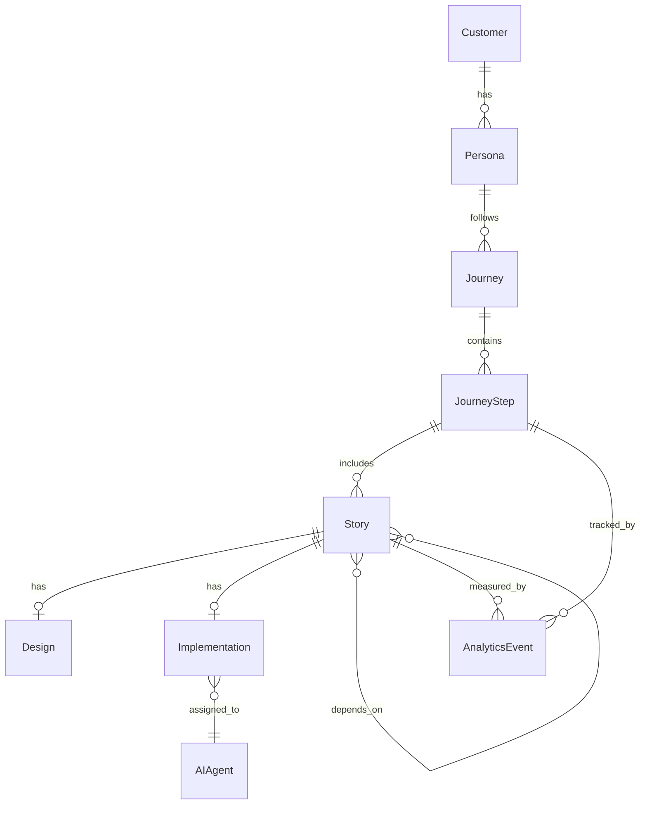

# Architecture Overview

## 🎯 Design Principles

1. **AI-First**: Every component designed for AI agent interaction
2. **Graph-Based**: All entities connected through knowledge graph
3. **Event-Driven**: Loosely coupled, highly scalable
4. **API-First**: Every feature accessible via API
5. **Extensible**: Plugin architecture for customization

---

## 🏗️ System Architecture

```
┌─────────────────────────────────────────────────────────────────────┐
│                          PMOS Platform                               │
├─────────────────────────────────────────────────────────────────────┤
│                                                                       │
│  ┌─────────────────────────────────────────────────────────────┐   │
│  │                    Web Application                            │   │
│  │  ┌─────────┐ ┌─────────┐ ┌─────────┐ ┌─────────┐           │   │
│  │  │ Journey │ │ Stories │ │ Designs │ │ Analytics│           │   │
│  │  │ Editor  │ │  Board  │ │ Review  │ │  Dashboard│          │   │
│  │  └─────────┘ └─────────┘ └─────────┘ └─────────┘           │   │
│  └─────────────────────────────────────────────────────────────┘   │
│                              │                                       │
│                              ▼                                       │
│  ┌─────────────────────────────────────────────────────────────┐   │
│  │                      API Gateway                              │   │
│  │  ┌─────────────────────────────────────────────────────┐   │   │
│  │  │           REST / GraphQL / WebSocket                  │   │   │
│  │  └─────────────────────────────────────────────────────┘   │   │
│  └─────────────────────────────────────────────────────────────┘   │
│                              │                                       │
│        ┌─────────────────────┼─────────────────────┐               │
│        ▼                     ▼                     ▼               │
│  ┌──────────┐        ┌──────────┐        ┌──────────┐             │
│  │  Core    │        │   AI     │        │  Integrations│          │
│  │ Services │        │  Engine  │        │            │             │
│  └──────────┘        └──────────┘        └──────────┘             │
│        │                     │                     │               │
│        ▼                     ▼                     ▼               │
│  ┌─────────────────────────────────────────────────────────────┐   │
│  │                    Data Layer                                 │   │
│  │  ┌─────────┐ ┌─────────┐ ┌─────────┐ ┌─────────┐           │   │
│  │  │  Graph  │ │PostgreSQL│ │  Redis  │ │   S3    │           │   │
│  │  │   DB    │ │         │ │         │ │         │             │   │
│  │  └─────────┘ └─────────┘ └─────────┘ └─────────┘           │   │
│  └─────────────────────────────────────────────────────────────┘   │
│                                                                       │
└─────────────────────────────────────────────────────────────────────┘
```

---

## 📊 Data Model

### Core Entities

```typescript
// Customer & Personas
interface Customer {
  id: string;
  name: string;
  email?: string;
  segments: string[];
  attributes: Record<string, any>;
  createdAt: Date;
  updatedAt: Date;
}

interface Persona {
  id: string;
  name: string;
  description: string;
  goals: string[];
  frustrations: string[];
  demographics: Record<string, any>;
  jobsToBeDone: JobToBeDone[];
}

// Journey
interface Journey {
  id: string;
  name: string;
  description: string;
  personaId: string;
  version: number;
  steps: JourneyStep[];
  status: 'draft' | 'active' | 'archived';
}

interface JourneyStep {
  id: string;
  journeyId: string;
  order: number;
  name: string;
  description: string;
  screenshot?: string;
  goal: string;
  painPoints: string[];
  stories: Story[];
  analytics: AnalyticsData;
}

// Story Mapping
interface StoryMap {
  id: string;
  name: string;
  journeyId: string;
  activities: Activity[];
}

interface Activity {
  id: string;
  name: string;
  tasks: Task[];
}

interface Task {
  id: string;
  name: string;
  stories: Story[];
}

interface Story {
  id: string;
  title: string;
  description: string;
  acceptanceCriteria: string[];
  priority: Priority;
  status: StoryStatus;
  design?: Design;
  implementation?: Implementation;
  metrics?: StoryMetrics;
}

// Design
interface Design {
  id: string;
  storyId: string;
  type: 'wireframe' | 'mockup' | 'prototype';
  assets: DesignAsset[];
  status: 'draft' | 'review' | 'approved';
  comments: Comment[];
}

// Implementation
interface Implementation {
  id: string;
  storyId: string;
  agentId: string;
  plan: ImplementationPlan;
  branch: string;
  pullRequest?: string;
  status: 'planned' | 'in-progress' | 'review' | 'merged';
}

// AI Agent
interface AIAgent {
  id: string;
  name: string;
  role: AgentRole;
  context: AgentContext;
  memory: AgentMemory;
  skills: string[];
  status: 'idle' | 'busy' | 'offline';
}

// Product Graph
interface GraphNode {
  id: string;
  type: EntityType;
  data: any;
  connections: GraphEdge[];
}

interface GraphEdge {
  source: string;
  target: string;
  relationship: string;
  weight?: number;
}
```

### Entity Relationships



---

## 🔌 API Design

### REST Endpoints

```
# Discovery
POST   /api/v1/discover/website
POST   /api/v1/discover/repository
POST   /api/v1/discover/greenfield

# Customers & Personas
GET    /api/v1/customers
POST   /api/v1/customers
GET    /api/v1/personas
POST   /api/v1/personas

# Journeys
GET    /api/v1/journeys
POST   /api/v1/journeys
GET    /api/v1/journeys/:id
PUT    /api/v1/journeys/:id
DELETE /api/v1/journeys/:id
GET    /api/v1/journeys/:id/versions

# Story Maps
GET    /api/v1/story-maps
POST   /api/v1/story-maps
GET    /api/v1/story-maps/:id
PUT    /api/v1/story-maps/:id

# Stories
GET    /api/v1/stories
POST   /api/v1/stories
GET    /api/v1/stories/:id
PUT    /api/v1/stories/:id
POST   /api/v1/stories/:id/generate-spec

# Designs
GET    /api/v1/designs
POST   /api/v1/designs
GET    /api/v1/designs/:id
PUT    /api/v1/designs/:id
POST   /api/v1/designs/:id/approve

# Implementations
GET    /api/v1/implementations
POST   /api/v1/implementations
GET    /api/v1/implementations/:id
POST   /api/v1/implementations/:id/assign-agent

# AI Agents
GET    /api/v1/agents
POST   /api/v1/agents
GET    /api/v1/agents/:id
POST   /api/v1/agents/:id/execute

# Analytics
GET    /api/v1/analytics/events
POST   /api/v1/analytics/events
GET    /api/v1/analytics/stories/:id
GET    /api/v1/analytics/journeys/:id

# Graph
GET    /api/v1/graph/nodes
GET    /api/v1/graph/nodes/:id
GET    /api/v1/graph/connections/:id
POST   /api/v1/graph/query
```

---

## 🧠 AI Engine

### Agent Architecture

```
┌─────────────────────────────────────────────────────────────┐
│                      AI Engine                                │
├─────────────────────────────────────────────────────────────┤
│                                                               │
│  ┌─────────────────────────────────────────────────────┐   │
│  │                  Agent Orchestrator                   │   │
│  │  - Task assignment                                   │   │
│  │  - Context management                                │   │
│  │  - Conflict resolution                               │   │
│  └─────────────────────────────────────────────────────┘   │
│                              │                               │
│        ┌─────────────────────┼─────────────────────┐       │
│        ▼                     ▼                     ▼       │
│  ┌──────────┐        ┌──────────┐        ┌──────────┐     │
│  │  Product │        │  Design  │        │  Coding  │     │
│  │  Agents  │        │  Agents  │        │  Agents  │     │
│  └──────────┘        └──────────┘        └──────────┘     │
│        │                     │                     │       │
│        ▼                     ▼                     ▼       │
│  ┌─────────────────────────────────────────────────────┐   │
│  │                  Shared Context                       │   │
│  │  - Product Graph                                     │   │
│  │  - Memory Store                                      │   │
│  │  - Skill Library                                     │   │
│  └─────────────────────────────────────────────────────┘   │
│                                                               │
└─────────────────────────────────────────────────────────────┘
```

### Agent Roles

```typescript
type AgentRole = 
  | 'chief-product-officer'
  | 'product-manager'
  | 'product-analyst'
  | 'ux-researcher'
  | 'ux-designer'
  | 'system-architect'
  | 'frontend-engineer'
  | 'backend-engineer'
  | 'qa-engineer'
  | 'devops-engineer'
  | 'documentation-writer'
  | 'release-manager'
  | 'analytics-engineer';
```

---

## 🔗 Integrations

### GitHub Integration

```typescript
interface GitHubIntegration {
  // Repository management
  cloneRepository(url: string): Promise<Repository>;
  analyzeRepository(repo: Repository): Promise<RepositoryAnalysis>;
  
  // Branch management
  createBranch(name: string, base: string): Promise<Branch>;
  createPullRequest(branch: string, title: string, body: string): Promise<PullRequest>;
  
  // Issue tracking
  createIssue(title: string, body: string, labels: string[]): Promise<Issue>;
  linkIssueToStory(issueId: string, storyId: string): Promise<void>;
  
  // Deployment
  triggerDeployment(branch: string, environment: string): Promise<Deployment>;
  getDeploymentStatus(deploymentId: string): Promise<DeploymentStatus>;
}
```

### Design Tools

```typescript
interface DesignIntegration {
  // AIonUX
  generateWireframe(story: Story): Promise<DesignAsset>;
  generateMockup(wireframe: DesignAsset): Promise<DesignAsset>;
  generatePrototype(mockup: DesignAsset): Promise<DesignAsset>;
  
  // Figma (future)
  syncDesignSystem(): Promise<DesignSystem>;
  exportComponents(): Promise<Component[]>;
}
```

### Analytics Platforms

```typescript
interface AnalyticsIntegration {
  // Amplitude
  trackEvent(event: AnalyticsEvent): Promise<void>;
  getMetrics(query: MetricsQuery): Promise<MetricsResult>;
  
  // Mixpanel
  identifyUser(userId: string, properties: Record<string, any>): Promise<void>;
  getFunnel(funnelId: string): Promise<FunnelResult>;
  
  // PostHog
  getInsights(query: InsightQuery): Promise<InsightResult>;
  
  // Google Analytics
  getReport(reportRequest: ReportRequest): Promise<ReportResult>;
}
```

---

## 🔒 Security

### Authentication

- JWT-based authentication
- OAuth 2.0 for third-party integrations
- API key authentication for programmatic access

### Authorization

```typescript
type Permission = 
  | 'journey:create'
  | 'journey:read'
  | 'journey:update'
  | 'journey:delete'
  | 'story:create'
  | 'story:read'
  | 'story:update'
  | 'story:delete'
  | 'design:read'
  | 'design:approve'
  | 'implementation:assign'
  | 'agent:execute'
  | 'analytics:read'
  | 'admin:manage';
```

### Data Protection

- Encryption at rest (AES-256)
- Encryption in transit (TLS 1.3)
- GDPR compliance features
- Data retention policies

---

## 📈 Scalability

### Horizontal Scaling

- Stateless API servers
- Load balancing
- Auto-scaling based on demand

### Caching Strategy

- Redis for session management
- CDN for static assets
- Query result caching

### Database Optimization

- Read replicas for PostgreSQL
- Connection pooling
- Query optimization

---

## 🧪 Testing Strategy

```
├── Unit Tests (70%)
│   ├── Business logic
│   ├── Utilities
│   └── Components
│
├── Integration Tests (20%)
│   ├── API endpoints
│   ├── Database operations
│   └── External services
│
└── E2E Tests (10%)
    ├── Critical user flows
    └── Cross-browser testing
```

---

## 📦 Deployment

### Environments

| Environment | Purpose | URL |
|-------------|---------|-----|
| Development | Local development | localhost |
| Staging | Pre-production testing | staging.pmos.dev |
| Production | Live system | app.pmos.dev |

### CI/CD Pipeline

```yaml
stages:
  - lint
  - test
  - build
  - deploy-staging
  - integration-tests
  - deploy-production
```

---

## 🔮 Future Considerations

1. **GraphQL Federation** - For complex graph queries
2. **Event Sourcing** - For complete audit trail
3. **CQRS** - Separate read/write models
4. **Microservices** - For independent scaling
5. **Multi-tenancy** - Enterprise support

---

*For detailed documentation on each module, see [docs/modules/](./modules/)*
