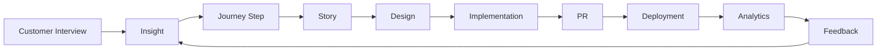

# Product Flight Recorder

## Overview

The Product Flight Recorder preserves every product decision, creating an unbroken chain from customer insight to production deployment. Nothing becomes disconnected.

---

## The Chain

```
Customer Interview
       │
       ▼
    Insight
       │
       ▼
    Journey
       │
       ▼
     Story
       │
       ▼
    Design
       │
       ▼
Implementation
       │
       ▼
 Pull Request
       │
       ▼
  Deployment
       │
       ▼
  Analytics
       │
       ▼
Customer Feedback
       │
       ▼
   [Cycle]
```

---

## Recorded Events

### Discovery Phase

```typescript
interface DiscoveryEvent {
  type: 'interview' | 'support-ticket' | 'analytics-insight' | 'user-feedback';
  timestamp: Date;
  source: string;
  content: string;
  participants?: string[];
  insights: Insight[];
}
```

### Journey Phase

```typescript
interface JourneyEvent {
  type: 'journey-created' | 'journey-updated' | 'step-added' | 'step-modified';
  timestamp: Date;
  journeyId: string;
  changes: Change[];
  author: string;
  reasoning?: string;
}
```

### Story Phase

```typescript
interface StoryEvent {
  type: 'story-created' | 'story-refined' | 'priority-changed' | 'status-changed';
  timestamp: Date;
  storyId: string;
  changes: Change[];
  author: string;
  reasoning?: string;
}
```

### Design Phase

```typescript
interface DesignEvent {
  type: 'design-started' | 'design-reviewed' | 'design-approved' | 'design-revised';
  timestamp: Date;
  designId: string;
  author: string;
  feedback?: string;
  decisions: Decision[];
}
```

### Implementation Phase

```typescript
interface ImplementationEvent {
  type: 'plan-created' | 'agent-assigned' | 'code-committed' | 'pr-created' | 'pr-merged';
  timestamp: Date;
  implementationId: string;
  agent?: string;
  details: Record<string, any>;
}
```

### Deployment Phase

```typescript
interface DeploymentEvent {
  type: 'deployed' | 'rolled-back' | 'feature-flag-toggled';
  timestamp: Date;
  environment: string;
  version: string;
  changes: string[];
}
```

### Analytics Phase

```typescript
interface AnalyticsEvent {
  type: 'metrics-collected' | 'insight-generated' | 'alert-triggered';
  timestamp: Date;
  storyId: string;
  metrics: Record<string, number>;
  insight?: string;
}
```

---

## Visualization

### Timeline View

```
Timeline: Feature "Data Export"
├── 2024-01-15: Customer interview (Sarah)
│   └── Insight: "Need to share data with stakeholders"
├── 2024-01-18: Journey step added
│   └── Step: "Data Export" in Onboarding journey
├── 2024-01-20: Story created
│   └── Story: "Export project data as CSV"
├── 2024-01-22: Design started
│   └── Wireframe: Export modal
├── 2024-01-25: Design approved
│   └── PM: "Looks great, ship it"
├── 2024-01-26: Implementation started
│   └── Agent: Frontend Engineer
├── 2024-01-28: PR created
│   └── PR #456: "feat: Add CSV export"
├── 2024-01-29: PR merged
│   └── Approved by: PM, Tech Lead
├── 2024-01-30: Deployed to production
│   └── Version: v2.3.0
├── 2024-02-06: First metrics
│   └── Adoption: 15% of users
└── 2024-02-13: Customer feedback
    └── "Love the export feature! - Mike"
```

### Graph View



---

## API Endpoints

### Record Event

```typescript
trpc.flightRecorder.record.mutate({
  type: EventType;
  entity: EntityReference;
  data: Record<string, any>;
  author?: string;
  reasoning?: string;
})
```

### Get Timeline

```typescript
trpc.flightRecorder.getTimeline.query({
  entityType: 'story' | 'journey' | 'feature';
  entityId: string;
  dateRange?: DateRange;
})
```

### Search Events

```typescript
trpc.flightRecorder.search.query({
  query: string;
  types?: EventType[];
  dateRange?: DateRange;
})
```

### Export History

```typescript
trpc.flightRecorder.export.query({
  entityType: 'story' | 'journey';
  entityId: string;
  format: 'json' | 'markdown' | 'pdf';
})
```

---

## Components

### TimelineView

Visual timeline of all events for an entity.

### EventCard

Individual event card with details and context.

### DecisionLog

Log of all decisions with reasoning.

### TraceabilityMap

Visual graph showing connections between entities.

### HistoryExport

Export complete history as documentation.

---

## Automatic Recording

PMOS automatically records events when:

| Action | Event Recorded |
|--------|----------------|
| Story created | Story creation event |
| Status changed | Status change event |
| Comment added | Feedback event |
| PR created | Implementation event |
| Deployment | Deployment event |
| Metric collected | Analytics event |

---

## Querying History

### Find Decision Rationale

```typescript
// Why was this priority chosen?
const decisions = await trpc.flightRecorder.search.query({
  query: 'priority change',
  entityId: 'story-123',
  types: ['priority-changed'],
});

// Returns reasoning for each priority change
```

### Trace Feature Origin

```typescript
// Where did this feature come from?
const timeline = await trpc.flightRecorder.getTimeline.query({
  entityType: 'story',
  entityId: 'story-123',
});

// Shows complete chain from interview to deployment
```

---

## Best Practices

1. **Always Document Reasoning** - Record why decisions were made
2. **Link Related Items** - Connect stories to journeys to designs
3. **Include Stakeholders** - Record who was involved
4. **Review Timeline** - Check history before making changes
5. **Export for Compliance** - Generate reports when needed

---

## Compliance & Audit

The flight recorder supports:

- **SOC 2** - Audit trail for controls
- **GDPR** - Data processing records
- **ISO 27001** - Change management
- **Internal Audit** - Decision documentation

---

## Future Enhancements

- [ ] AI-powered decision summaries
- [ ] Predictive impact analysis
- [ ] Automated compliance reports
- [ ] Integration with project management tools
- [ ] Natural language search
