# PMOS — Architecture Overview

## System Architecture

PMOS is an AI-native, file-based product operating system that manages the full product lifecycle through markdown/JSON files at `~/.pmos/`. The PMOS-UI is a Next.js 14 dashboard that provides a visual interface for product managers.

```mermaid
graph TB
    subgraph "PMOS-UI (Next.js 14)"
        Dashboard["Dashboard /page"]
        StoryMap["Story Map /story-map"]
        Kanban["Agent Kanban /kanban"]
        Pipeline["Pipeline /pipeline"]
        CustomerJourney["Customer Journey /journey"]
        Stories["Stories Board /stories"]
        Setup["Source Setup /setup"]
        Intelligence["Intelligence View"]
    end

    subgraph "API Layer"
        ProjectsAPI["/api/projects"]
        StoriesAPI["/api/projects/[slug]/stories"]
        PipelineAPI["/api/projects/[slug]/pipeline"]
        IntelAPI["/api/projects/[slug]/intelligence-stories"]
        JourneysAPI["/api/projects/[slug]/journeys"]
        FSBrowse["/api/fs/browse"]
        GitHubAPI["/api/github/repos"]
    end

    subgraph "File System (~/.pmos/)"
        Registry["registry.json"]
        ProjectDir["projects/{slug}/"]
        Intelligence["intelligence/*.md"]
        Journey["journey/persona-*.md"]
        StoriesDir["stories/backlog/*.md"]
        PipelineState["pipeline-state.json"]
        SourceLoc["source-location.json"]
        Commands["commands/*.md"]
    end

    subgraph "External Codebases"
        LocalFS["Local Filesystem"]
        GitHub["GitHub API"]
    end

    Dashboard --> ProjectsAPI
    StoryMap --> StoriesAPI
    Kanban --> IntelAPI
    Pipeline --> PipelineAPI
    CustomerJourney --> JourneysAPI
    Setup --> FSBrowse
    Setup --> GitHubAPI

    ProjectsAPI --> Registry
    ProjectsAPI --> ProjectDir
    StoriesAPI --> StoriesDir
    PipelineAPI --> PipelineState
    IntelAPI --> Intelligence
    JourneysAPI --> Journey
    FSBrowse --> LocalFS
    GitHubAPI --> GitHub
```



## Architecture Pattern

### File-Based Product OS
PMOS uses **no databases** — all state lives in markdown/JSON files that AI agents can read and write directly. This enables:
- AI-native workflows (agents read/write files directly)
- Version control with git
- Human-readable product artifacts
- Zero infrastructure requirements

### Next.js 14 App Router
- **Server Components**: Read files from `~/.pmos/` at request time
- **Client Components**: Interactive boards with drag-and-drop (@dnd-kit)
- **API Routes**: CRUD operations on stories, pipeline, intelligence

### Data Flow
```
User Action → UI Component → API Route → File System Read/Write → Response
```

## Key Components

### 1. Dashboard (`/page.tsx`)
- Project cards with health scores, story counts, agent activity
- Add Project wizard (filesystem browser + GitHub search)

### 2. Story Map (`/projects/[slug]/story-map/`)
- Horizontal scrolling journey step columns (Jeff Patton style)
- Stories stacked vertically by priority within each step
- Drag-and-drop between steps (@dnd-kit)
- Live token cost + ROI on every card
- Click-to-view/edit StoryDetailModal
- CreateStoryForm with live cost estimation

### 3. Agent Kanban (`/projects/[slug]/kanban/`)
- 7 agent columns (PM, UX, Architect, SE, QA, Docs, Intelligence)
- Intelligence stories auto-assigned to correct agent roles
- Drag-and-drop between agent columns
- Cost → Value → ROI on every card

### 4. Customer Journey (`/projects/[slug]/journey/`)
- Per-persona horizontal boards
- Live app preview via iframe
- Pain points, tasks, stories per step

### 5. Pipeline (`/projects/[slug]/pipeline/`)
- 9-step interactive pipeline
- Step-by-step execution with Continue/Run All
- Progress bar, status icons, execution log

### 6. Stories Board (`/projects/[slug]/stories/`)
- Mike Cohn format (As a/I want to/so that)
- Gherkin acceptance criteria
- Persona badges, business goals
- Token cost estimates

### 7. Add Project Wizard
- Step 1: Source type (Local/GitHub)
- Step 2: FileSystemBrowser or GitHubSearch
- Step 3: Confirm with name + summary

## Component Architecture

```
src/
├── app/
│   ├── page.tsx                          # Dashboard
│   ├── layout.tsx                        # Root layout
│   ├── globals.css                       # Tailwind + shadcn
│   ├── api/
│   │   ├── projects/route.ts             # CRUD projects
│   │   ├── projects/list/route.ts        # List with dashboard data
│   │   ├── projects/[slug]/
│   │   │   ├── stories/route.ts          # CRUD stories
│   │   │   ├── pipeline/route.ts         # Pipeline execution
│   │   │   ├── intelligence-stories/route.ts  # Parse intel → stories
│   │   │   └── journeys/route.ts         # Enriched persona journeys
│   │   ├── fs/browse/route.ts            # Local filesystem browser
│   │   └── github/repos/route.ts         # GitHub repo search
│   └── projects/[slug]/
│       ├── story-map/story-map-board.tsx  # Interactive story map
│       ├── kanban/kanban-board.tsx        # Agent kanban
│       ├── journey/persona-journey.tsx    # Customer journey
│       ├── pipeline/page.tsx              # Pipeline execution
│       ├── stories/stories-board.tsx      # Stories board
│       └── setup/page.tsx                 # Source location config
├── components/
│   ├── ui/                               # shadcn/ui primitives
│   ├── story-detail-modal.tsx            # Shared story modal
│   ├── add-project-wizard.tsx            # Add project wizard
│   ├── github-search.tsx                 # GitHub repo search
│   ├── filesystem-browser.tsx            # Local FS browser
│   └── journey/
│       ├── persona-journey.tsx           # Persona journey board
│       └── pipeline-screen.tsx           # Pipeline screen preview
├── lib/
│   ├── pmos.ts                           # File parsing + creation
│   ├── cost-estimation.ts                # Token cost + ROI formulas
│   └── utils.ts                          # shadcn utilities
└── types/
    └── pmos.ts                           # TypeScript interfaces
```

## File System Structure

```
~/.pmos/
├── registry.json                         # All projects
├── commands/                             # PMOS agent commands
│   ├── create-user-story.md
│   ├── run-pipeline.md
│   └── attach-project.md
├── projects/
│   ├── {slug}/
│   │   ├── project.md                    # Project description
│   │   ├── source-location.json          # Where code lives
│   │   ├── pipeline-state.json           # Pipeline execution state
│   │   ├── dashboard.md                  # Live health metrics
│   │   ├── intelligence/                 # Repository analysis
│   │   │   ├── architecture.md
│   │   │   ├── tech-stack.md
│   │   │   ├── features.md
│   │   │   ├── code-quality.md
│   │   │   ├── improvements.md
│   │   │   ├── domain-model.md
│   │   │   ├── api-docs.md
│   │   │   └── missing-docs.md
│   │   ├── journey/                      # Customer journey
│   │   │   ├── persona-{name}.md
│   │   │   └── screens.json
│   │   ├── stories/                      # User stories
│   │   │   ├── story-map.md
│   │   │   ├── backlog/
│   │   │   ├── in-progress/
│   │   │   ├── review/
│   │   │   └── done/
│   │   └── agents/                       # Agent assignments
│   │       └── *.md
│   └── ...
└── pmos-ui/                              # The PMOS dashboard itself
    ├── src/
    ├── package.json
    └── next.config.mjs
```
