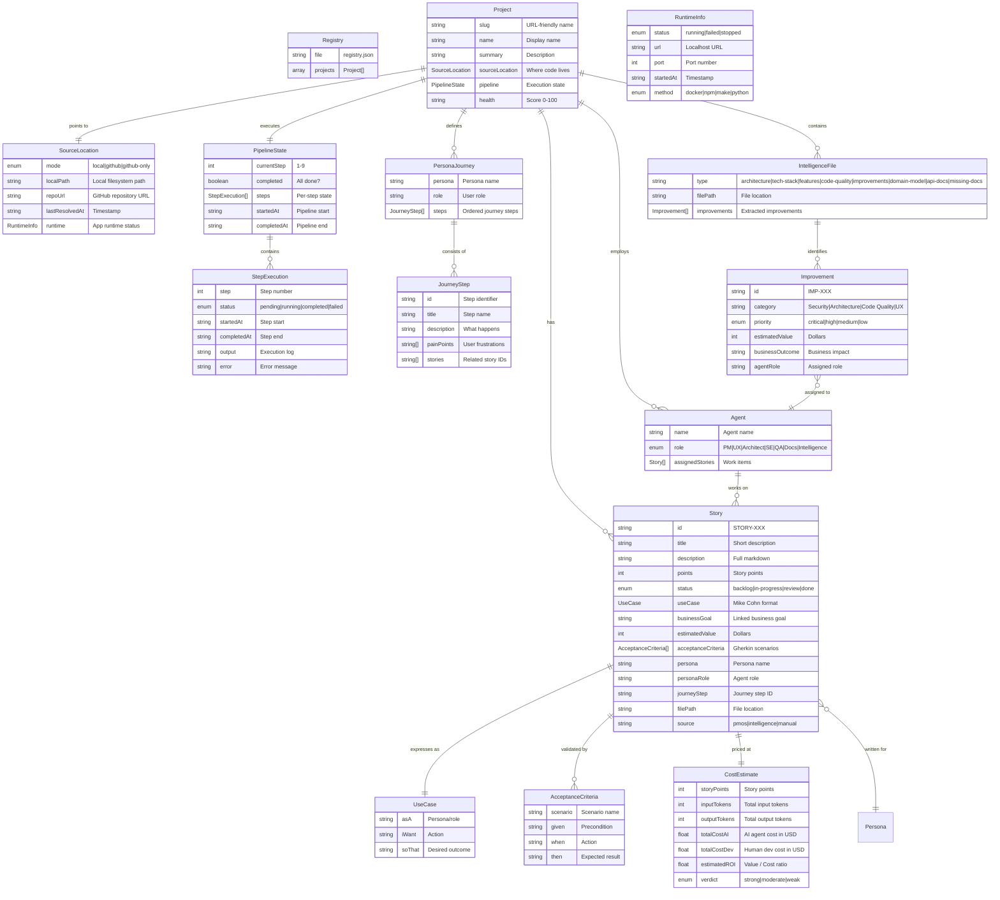

# PMOS — Domain Model

## Core Entities

## Relationships

| Relationship | Cardinality | Description |
|-------------|-------------|-------------|
| Project → Story | 1:N | A project has many stories |
| Project → PersonaJourney | 1:N | A project has journeys per persona |
| Project → IntelligenceFile | 1:N | Analysis produces multiple intel files |
| Project → Agent | 1:7 | Each project has 7 agent roles |
| Story → UseCase | 1:1 | Each story has one Mike Cohn use case |
| Story → AcceptanceCriteria | 1:N | Each story has 1+ Gherkin scenarios |
| Story → CostEstimate | 1:1 | Each story has one cost estimate |
| Persona → Story | 1:N | A persona generates many stories |
| IntelligenceFile → Improvement | 1:N | Intel files identify improvements |
| Improvement → Agent | N:1 | Each improvement assigned to one agent |
| Agent → Story | 1:N | Each agent works on many stories |
| PipelineState → StepExecution | 1:N | Pipeline has 9 step executions |
| PersonaJourney → JourneyStep | 1:N | Each persona journey has many steps |

## Enumerations

### Project Source Mode
- `local` — Code lives on local filesystem
- `github` — Local clone + GitHub remote
- `github-only` — No local clone, GitHub API only

### Story Status
- `backlog` — Not yet started
- `in-progress` — Actively being worked on
- `review` — Ready for review
- `done` — Completed and shipped

### Agent Roles
- `Product Manager` — Roadmap, stories, priorities
- `UX Designer` — Journey, wireframes, accessibility
- `Architect` — Architecture, patterns, tech debt
- `Software Engineer` — Implementation, testing, PRs
- `QA Engineer` — Testing, regression, performance
- `Documentation Agent` — README, API docs, release notes
- `Product Intelligence` — Monitoring, anomaly detection

### Pipeline Steps (1-9)
1. Resolve Source
2. Repository Intelligence
3. Run Application
4. Customer Journey Discovery
5. Story Mapping
6. Build Initial Backlog
7. Build Agent Kanban
8. Product Dashboard
9. Continuous Learning
