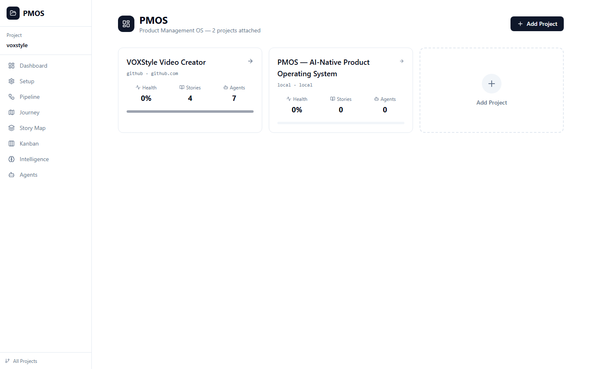
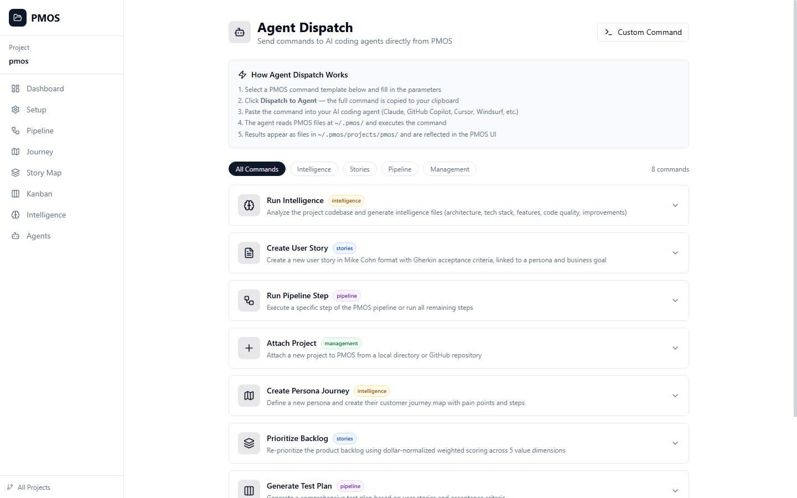
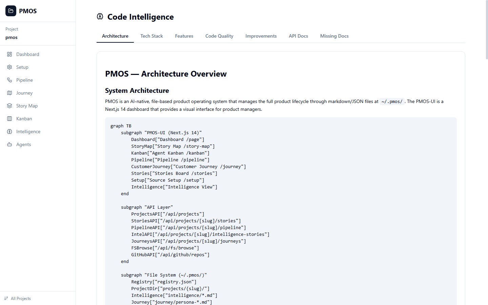
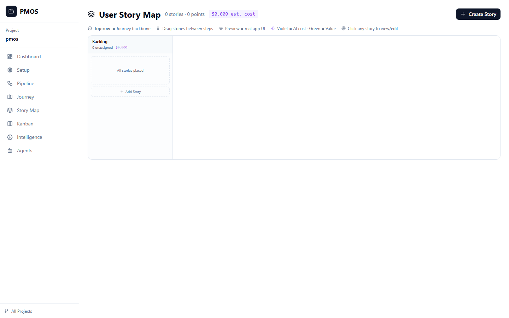
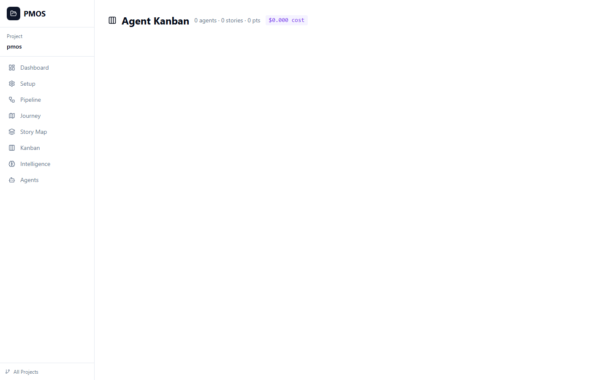

# Customer Journey — Agent (AI Coder)

**Persona**: AI Coding Agent (Claude, GPT, Gemini), 24/7, Omniscient
**Quote**: "I don't need a GUI. Give me markdown files and I'll run the full product pipeline."

---

### Journey Steps (Left → Right)

| Step | Activity | Tasks | Pain Points | Screen |
|------|----------|-------|-------------|--------|
| **1. Discover Context** | Read ~/.pmos/ to understand project | Read registry.json, project.md, source-location.json, persona journeys | Where is data stored? What format? Which project to work on? |  |
| **2. Execute Commands** | Run PMOS commands naturally | Attach project, run pipeline, create story, re-prioritize | What commands available? Expected output format? Must match Mike Cohn + Gherkin |  |
| **3. Read Intelligence** | Ingest codebase analysis | Read architecture.md, tech-stack.md, features.md, quality.md, improvements.md | Need structured data not prose. What's new vs tracked? |  |
| **4. Create Artifacts** | Write PMOS files | Write stories to backlog/, update status, write intelligence, write journeys | Exact markdown format? Required frontmatter fields? Must match Mike Cohn + Gherkin |  |
| **5. Review Kanban** | Check agent assignments | Read stories/ directory, identify unassigned, check agent capacity | How to know agent assignments? Status distribution? |  |
| **6. Respond to PM** | Answer queries using PMOS data | Project status, prioritized backlog, top risks, sprint cost | Aggregate across files, consistent dollar calculations, flag stale data |  |

### Stories Under This Journey
| Story | Step | Points | Status |
|-------|------|--------|--------|
