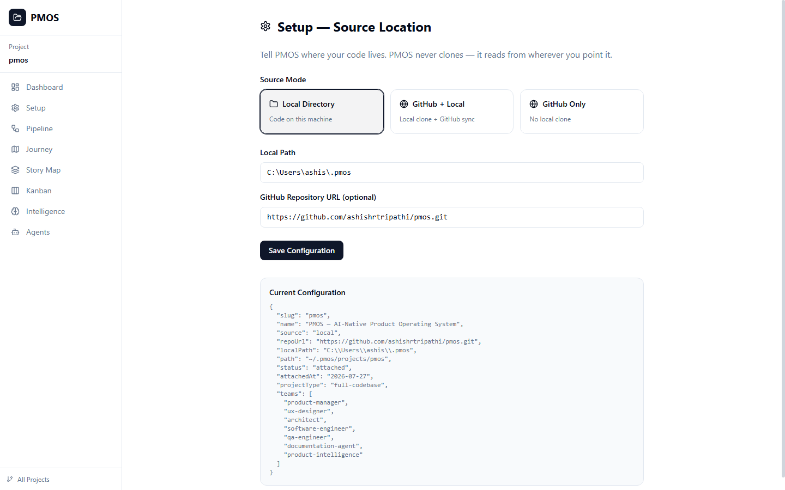
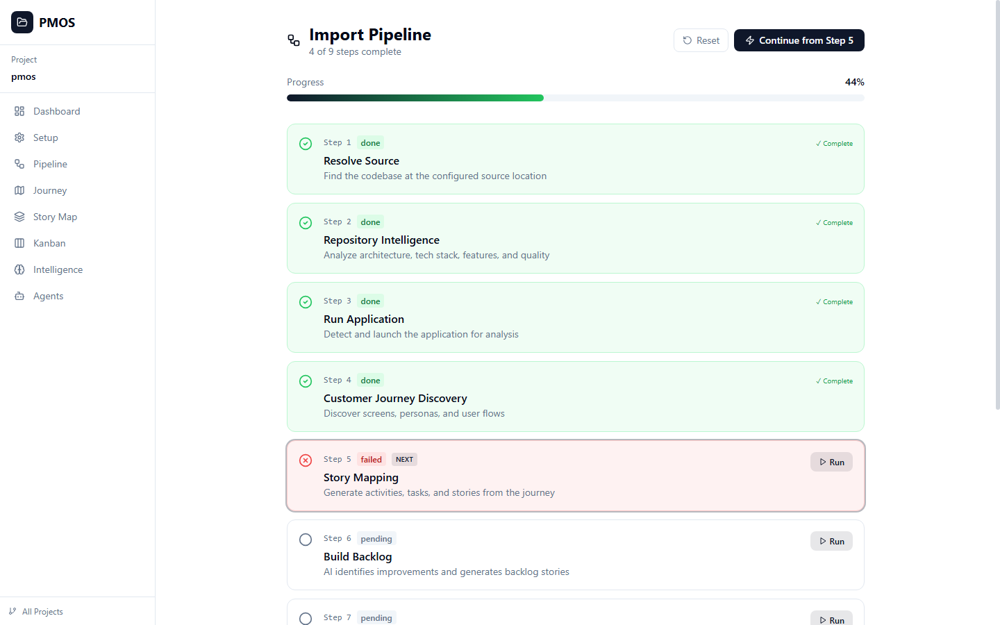
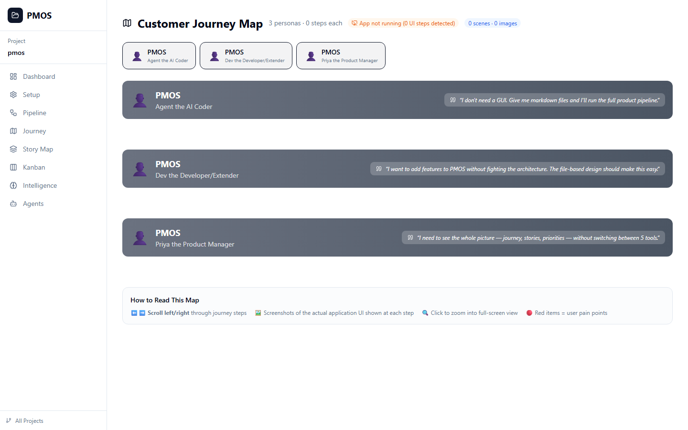
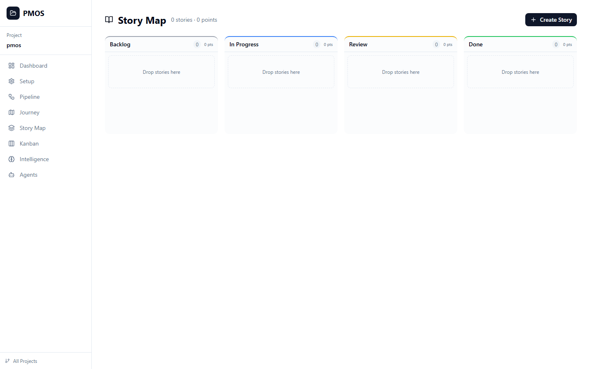

# Customer Journey — Priya (Senior Product Manager)

**Persona**: Senior Product Manager, 35, Expert
**Quote**: "I need to see the whole picture — journey, stories, priorities — without switching between 5 tools."
**Image**: https://images.unsplash.com/photo-1573496359142-b8d87734a5a2?w=600&auto=format&fit=crop&q=80

---

### Journey Steps (Left -> Right)

| Step | Activity | Tasks | Pain Points | Screen |
|------|----------|-------|-------------|--------|
| **1. Setup** | Connect a project | Pick local folder or GitHub repo, review source-location, verify reading | Don't clone repos, understand structure |  |
| **2. Pipeline** | Run pipeline steps | Execute steps, monitor progress, continue from failure, view completion | See what step the project is in, recover from failure |  |
| **3. Intelligence** | Review codebase analysis | Trigger scan, review architecture/features/quality, act on improvements | Verify AI understood correctly, see findings |  |
| **4. OKRs** | Set quarterly goals | Create OKRs, define key results, link stories, track progress | See goal progress, align roadmap to OKRs |  |
| **5. Journey** | Map personas | Create personas, map steps, identify pain points, preview UI | Can't map without seeing UI, per-persona journeys needed |  |
| **6. Story Map** | Build the backlog | Create stories from backbone, assign persona, write Gherkin AC, estimate ROI | Stories trace to persona/step, see token costs AND dollars |  |
| **7. Kanban** | Manage delivery | Review assignments, drag between agents, re-prioritize, close | Know which agent does what, intelligence becomes stories automatically |  |
| **8. Standup** | Daily sync | Review in-progress, blockers, plan, share with team | See progress without status updates, surface stale work |  |
| **9. Bugs** | Triage defects | Review bugs, prioritize fixes, assign, track to closure | Prioritize by impact, trace to story, verify fix |  |
| **10. Agents** | Dispatch agents | Pick command template, fill parameters, dispatch, view history | Send commands from UI, command library ready |  |

### Stories Under This Journey
| Story | Step | Points | Status |
|-------|------|--------|--------|
