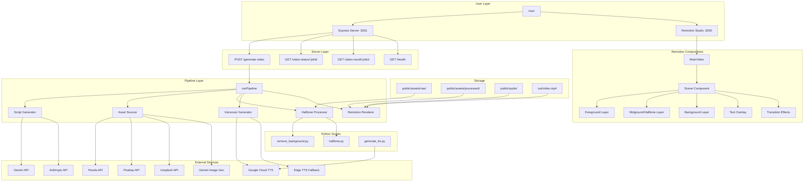

# VOXStyle — Architecture Overview

> Generated by PMOS Intelligence Agent on 2026-07-22
> Source: `C:\Users\ashis\VoxStyle Vdieo Creator\vox-style-video`

## High-Level Architecture



## Architecture Type

**Hybrid Monolith** — Single deployable unit with clear internal layering:

| Layer | Responsibility | Technologies |
|-------|---------------|-------------|
| **Server** | HTTP API, job management | Express.js, in-memory job store |
| **Pipeline** | Video generation orchestration | TypeScript, child process (Python) |
| **External** | AI/stock services | Gemini, Pexels, Google TTS |
| **Processing** | Image manipulation | Python (rembg, Pillow, onnxruntime) |
| **Rendering** | Video composition | Remotion, React, Webpack |
| **Storage** | Asset filesystem | public/assets/, public/audio/, out/ |

## Data Flow

```
User Request (subject/topic)
  → Script Generator (Gemini/Anthropic)
  → Scene Table (20 scenes × voiceover + prompts)
  → Asset Sourcer (Pexels → Pixabay → Unsplash → Gemini → Placeholder)
  → Halftone Processor (Python: bg removal → halftone dots)
  → Voiceover (Google Cloud TTS or Edge TTS)
  → Audio Alignment (Whisper or estimated)
  → Remotion Compositing (React components)
  → MP4 Rendering (FFmpeg via Remotion)
  → Output: out/video.mp4
```

## Key Design Decisions

1. **No database** — All state is in-memory (job queue) or filesystem
2. **No framework** — Express is the only server dependency, no Next.js runtime
3. **Python interop** — Image processing delegated to Python via child_process.exec
4. **Asset fallback chain** — Pexels → Pixabay → Unsplash → Gemini → Placeholder
5. **Halftone caching** — MD5 hash of config + input used as cache key
6. **Scene data in Root.tsx** — Currently hardcoded, designed to come from pipeline

## Current Gaps

| Gap | Impact | Priority |
|-----|--------|----------|
| No persistent job storage | Jobs lost on server restart | High |
| In-memory job queue | Single process only | Medium |
| Scene data hardcoded in Root.tsx | Can't dynamically change topics | High |
| No error recovery in pipeline | Partial failures stop everything | Medium |
| No authentication on server | Anyone can trigger video generation | Low (local dev) |
