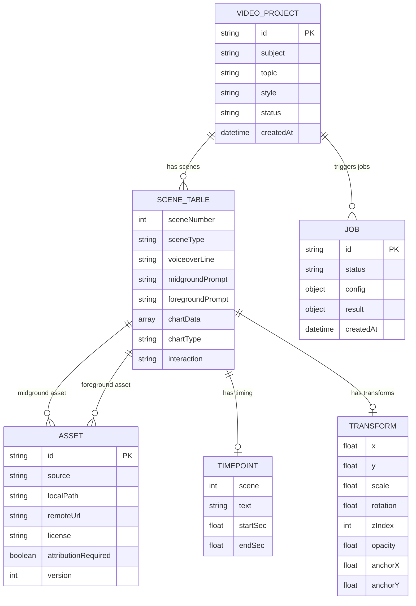

# VOXStyle — Domain Model

> Generated by PMOS Intelligence Agent on 2026-07-22

## Core Entities



## Scene Types

| Type | Description | Data |
|------|-------------|------|
| `cutout` | Subject image with foreground overlay | Midground + foreground images |
| `b-roll` | Background video/image with foreground | Midground + foreground images |
| `chart` | Data visualization overlay | chartData + chartType |

## Interaction Types

| Type | Description |
|------|-------------|
| `parallel` | Elements move in same direction (parallax) |
| `facing` | Elements move toward each other (contrast) |

## Asset Sources (Fallback Chain)

```
1. User Upload (future)
2. Pexels (stock photo/video)
3. Pixabay (stock photo)
4. Unsplash (stock photo)
5. Gemini (AI generated)
6. Placeholder (solid color)
```

## Pipeline Stages

| Stage | Input | Output | Tool |
|-------|-------|--------|------|
| Script Generation | Subject/topic | Scene table (20 scenes) | Gemini/Anthropic |
| Asset Sourcing | Scene prompts | Downloaded images | Pexels/Pixabay/Unsplash/Gemini |
| Background Removal | Raw image | Transparent PNG | Python rembg |
| Halftone Processing | Transparent PNG | Halftone dot image | Python Pillow |
| Voiceover | Scene text | MP3 audio + timepoints | Google TTS / Edge TTS |
| Audio Alignment | Audio + scenes | Precise timepoints | Whisper (estimated) |
| Composition | All assets + timepoints | React components | Remotion |
| Rendering | React compositions | MP4 video | Remotion + FFmpeg |
